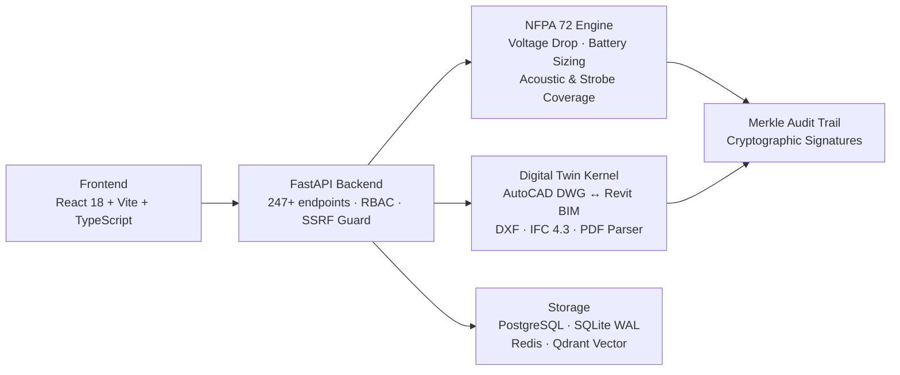

<div align="center">

# 🔥 BAZspark

**Safety-Critical Fire Alarm Engineering & Digital Twin Platform**

[](https://github.com/ahmdelbaz28-ux/BAZspark/actions)
[](https://github.com/ahmdelbaz28-ux/BAZspark/blob/main/LICENSE)
[](https://github.com/ahmdelbaz28-ux/BAZspark/stargazers)
[](https://github.com/ahmdelbaz28-ux/BAZspark/releases)

[](https://ba-zspark-tau.vercel.app)
[](https://ahmdelbaz28-bazspark.hf.space)

</div>

---

## What is this?

BAZspark automates fire alarm system design and compliance verification according to **NFPA 72-2022** and **SOLAS Marine** standards. It runs deterministic voltage drop and battery capacity calculations, generates a Merkle-tree signed audit trail for every design decision, and bridges AutoCAD DWG files to Autodesk Revit BIM models — eliminating manual drafting errors from protection engineering workflows.

---

## Quick Start

**Prerequisites:** Python 3.8+, Node.js 22+, npm 11+, Git 2.40+

```bash
# 1. Clone and install backend
git clone https://github.com/ahmdelbaz28-ux/BAZspark.git
cd BAZspark
pip install -e ".[dev,parsing]"

# 2. Set secrets and start the API server
export FIREAI_API_KEY="your-secure-api-key"
export FIREAI_SESSION_SECRET=$(python3 -m backend.session_secret generate | tail -1)
uvicorn backend.app:app --reload --host 127.0.0.1 --port 8000
```

```bash
# 3. Start the frontend (in a second terminal)
cd frontend
npm ci
npm run dev
# Open http://localhost:5173 → Settings → enter FIREAI_API_KEY
```

```bash
# Or run the entire stack with Docker
docker-compose up -d --build
```

---

## Screenshots

| Dashboard | Fire Alarm Canvas |
|-----------|------------------|
|  |  |

| Digital Twin | Compliance Center |
|-------------|------------------|
|  |  |

---

## Architecture



---

## Project Structure

```
BAZspark/
├── .github/workflows/     # CI/CD, deployment, and security scan pipelines
├── autocad_addin/         # AutoCAD C# .NET bridge add-in
├── backend/               # FastAPI routers, services, auth, and RBAC
├── deploy/                # Docker, Helm, and Kubernetes manifests
├── docs/                  # Architecture, API, and operational docs
├── facp_distributed/      # Distributed FACP multi-agent pipeline
├── fireai/                # NFPA 72 calculation engine and audit core
├── frontend/              # React SPA — canvas designer, dashboard, reports
├── marine/                # SOLAS marine fire detection compliance module
├── parsers/               # DXF, DWG, IFC, and PDF high-throughput parsers
├── qomn_fire/             # Standalone QOMN-FIRE physics kernel
├── scripts/               # Developer tooling and secret management
└── tests/                 # Unit and integration test suites (145+ tests)
```

---

## Documentation

| Resource | Description |
|----------|-------------|
| [Architecture Overview](docs/ARCHITECTURE_CHANGE_PROPOSAL_V2.md) | System design, component boundaries, and data flow |
| [API Keys Guide](docs/API_KEYS_GUIDE.md) | Generating and managing FIREAI_API_KEY and session secrets |
| [Production Deployment](docs/PRODUCTION_DEPLOYMENT_GUIDE.md) | Docker Compose, Kubernetes, and Vercel deployment steps |
| [NFPA 72 Specification](docs/FACP_SPECIFICATION.md) | Calculation methods, coverage rules, and standard references |
| [Dev Pipeline](docs/DEV_PIPELINE.md) | CI gates, test strategy, and PR review requirements |
| [Database Config](docs/DATABASE_STANDARD_CONFIG.md) | PostgreSQL, SQLite WAL, Redis, and Qdrant setup |
| [Release Notes](docs/RELEASE_NOTES.md) | Changelog and version history |

---

## Verification

```bash
# Run the full test suite (145+ tests)
pytest

# Run only security and SSRF tests
pytest tests/test_ssrf_and_security_protocol.py tests/test_security.py

# Run static linting (must pass before every PR)
python -m ruff check .

# Generate HTML coverage report
pytest --cov=fireai --cov-report=html
```

All pull requests must pass the CI quality gates — static analysis, security checks, calculation accuracy, and integration tests — before merge.

---

## Contributing

Engineering contributions are welcome. Open an issue to discuss significant changes before submitting a PR. All submissions undergo strict safety-critical code review.

<a href="https://github.com/ahmdelbaz28-ux/BAZspark/graphs/contributors">
  
</a>

---

## License

Distributed under the [MIT License](LICENSE).

Designed and developed by **Eng. Ahmed Elbaz**.

---

<div align="center">

[](https://star-history.com/#ahmdelbaz28-ux/BAZspark&Date)

</div>