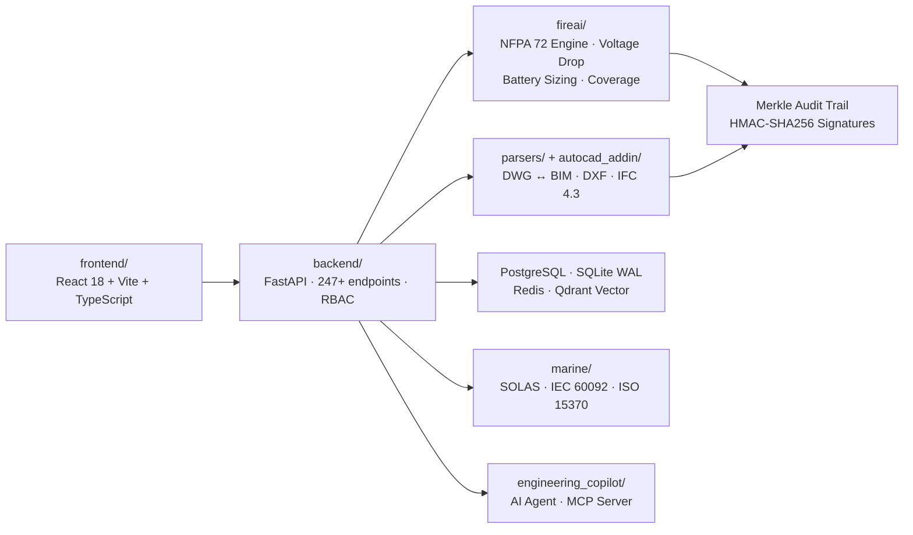

<div align="center">

# 🔥 BAZspark

**Safety-Critical Fire Alarm Engineering & Digital Twin Platform**

[](https://github.com/ahmdelbaz28-ux/BAZspark/actions)
[](https://github.com/ahmdelbaz28-ux/BAZspark/blob/main/LICENSE)
[](https://github.com/ahmdelbaz28-ux/BAZspark/stargazers)
[](https://github.com/ahmdelbaz28-ux/BAZspark/releases)

</div>

---

## What is this?

BAZspark automates fire alarm system design and compliance verification per **NFPA 72-2022** and **SOLAS Marine** standards. It runs deterministic voltage drop and battery capacity calculations, generates a Merkle-tree signed audit trail for every design decision, and bridges AutoCAD DWG to Revit BIM models — eliminating manual drafting errors from protection engineering workflows.

---

## Quick Start

This is a monorepo. The backend (Python/FastAPI) is the primary entry point; the frontend (React) runs separately.

**Prerequisites:** Python 3.8+, Node.js 22+, npm 11+, Git 2.40+

```bash
# Fastest: run the entire stack with Docker
git clone https://github.com/ahmdelbaz28-ux/BAZspark.git
cd BAZspark
docker-compose up -d --build
```

```bash
# Or start backend and frontend separately:
git clone https://github.com/ahmdelbaz28-ux/BAZspark.git
cd BAZspark
pip install -e ".[dev,parsing]"
export FIREAI_API_KEY="your-secure-api-key"
export FIREAI_SESSION_SECRET=$(python3 -m backend.session_secret generate | tail -1)
uvicorn backend.app:app --reload --host 127.0.0.1 --port 8000

# Frontend (in a second terminal):
cd frontend && npm ci && npm run dev
# Open http://localhost:5173 → Settings → enter FIREAI_API_KEY
```

---

## Screenshots

| Dashboard | Fire Alarm Canvas |
|-----------|------------------|
|  |  |

| Digital Twin | Compliance Center |
|-------------|------------------|
|  |  |

---

## Architecture



---

## Project Structure

```
BAZspark/
├── adapters/              # Cross-module adapters (PDF-to-rooms, etc.)
├── alembic/               # Database migration scripts and versions
├── autocad_addin/         # AutoCAD C# .NET bridge add-in
├── backend/               # FastAPI routers, services, auth, RBAC (pip)
│   ├── core/              # Core business logic and config
│   ├── db/                # Database service and models
│   ├── integrations/      # External service integrations
│   ├── middleware/         # SSRF guard, rate limiting, CSP
│   ├── routers/           # API route handlers (247+ endpoints)
│   ├── services/          # Domain service layer
│   ├── use_cases/         # Application use-case orchestration
│   └── utils/             # Shared backend utilities
├── core/                  # Shared core: models, DB, retry logic
├── deploy/                # Docker, Helm, K8s, Akamai, observability
├── docs/                  # Architecture, API, ADRs, operational docs
├── engineering_copilot/   # AI agent, MCP server, translation engine
├── facp_distributed/      # Distributed FACP multi-agent pipeline (L1/L2/L3)
├── fireai/                # NFPA 72 calculation engine and audit core
├── frontend/              # React SPA — canvas designer, dashboard, reports (npm)
├── marine/                # SOLAS marine fire detection compliance module
├── parsers/               # DXF, DWG, IFC, and PDF high-throughput parsers
├── qomn_conduit/          # Conduit routing and sizing engine
├── qomn_fire/             # Standalone QOMN-FIRE physics kernel
├── scripts/               # Developer tooling and secret management
├── tests/                 # Unit, integration, property-based, and factory tests
├── CHANGELOG.md           # Version history
├── CONTRIBUTING.md        # Contribution guide and CI/CD policy
├── Dockerfile             # Production container image
├── LICENSE                # MIT License
├── ONBOARDING.md          # Developer onboarding guide
├── SECURITY.md            # Vulnerability reporting and defense-in-depth
└── VERSION                # Current version string
```

---

## Documentation

| Resource | Description |
|----------|-------------|
| [Architecture Overview](ARCHITECTURE.md) | System design, component boundaries, and data flow |
| [Engineering Basis](ENGINEERING_BASIS.md) | NFPA 72/NEC/IBC formulas, constants, and citations |
| [Configuration Guide](CONFIGURATION_GUIDE.md) | Environment variables, secrets, and runtime config |
| [API Keys Guide](docs/API_KEYS_GUIDE.md) | Generating and managing FIREAI_API_KEY and session secrets |
| [Production Deployment](docs/PRODUCTION_DEPLOYMENT_GUIDE.md) | Docker Compose, Kubernetes, and Vercel deployment steps |
| [NFPA 72 Specification](docs/FACP_SPECIFICATION.md) | Calculation methods, coverage rules, and standard references |
| [Dev Pipeline](docs/DEV_PIPELINE.md) | CI gates, test strategy, and PR review requirements |
| [Database Config](docs/DATABASE_STANDARD_CONFIG.md) | PostgreSQL, SQLite WAL, Redis, and Qdrant setup |
| [Troubleshooting](TROUBLESHOOTING_GUIDE.md) | Common issues, diagnostics, and resolution steps |
| [Onboarding](ONBOARDING.md) | Developer onboarding and environment setup |
| [Security Policy](SECURITY.md) | Vulnerability reporting and defense-in-depth model |
| [Release Notes](docs/RELEASE_NOTES.md) | Changelog and version history |

### Package READMEs

| Package | Description |
|---------|-------------|
| [fireai/](fireai/README.md) | NFPA 72-2022 fire alarm design system — calculation engine and audit core |
| [facp_distributed/](facp_distributed/README.md) | Distributed FACP agent communication protocol (L1/L2/L3 planes) |
| [engineering_copilot/](engineering_copilot/README.md) | AI-driven engineering copilot — intent understanding, data sync, validation |
| [marine/](marine/README.md) | Ship and marine fire-protection engineering (SOLAS, IEC 60092, ISO 15370) |

---

## Live Demos

[](https://ba-zspark-tau.vercel.app)
[](https://ahmdelbaz28-bazspark.hf.space)

---

## Contributing

Engineering contributions are welcome. This is a **safety-critical system** — all changes must preserve deterministic execution and fail-safe behavior. Open an issue to discuss significant changes before submitting a PR.

Changes to the calculation engine (`fireai/core/`), NFPA 72 constants (`fireai/constants/`), or audit trail (`fireai/core/audit_trail.py`) require 100% branch coverage and property-based tests. All submissions must pass the CI quality gates (15 workflows including secret-scan, container-scan, and regulatory-data-guard).

See [CONTRIBUTING.md](CONTRIBUTING.md) for the complete guide and [ONBOARDING.md](ONBOARDING.md) to set up your environment.

<a href="https://github.com/ahmdelbaz28-ux/BAZspark/graphs/contributors">
  
</a>

---

## License

Distributed under the [MIT License](LICENSE).

Designed and developed by **Eng. Ahmed Elbaz**.

---

<div align="center">

[](https://star-history.com/#ahmdelbaz28-ux/BAZspark&Date)

</div>
