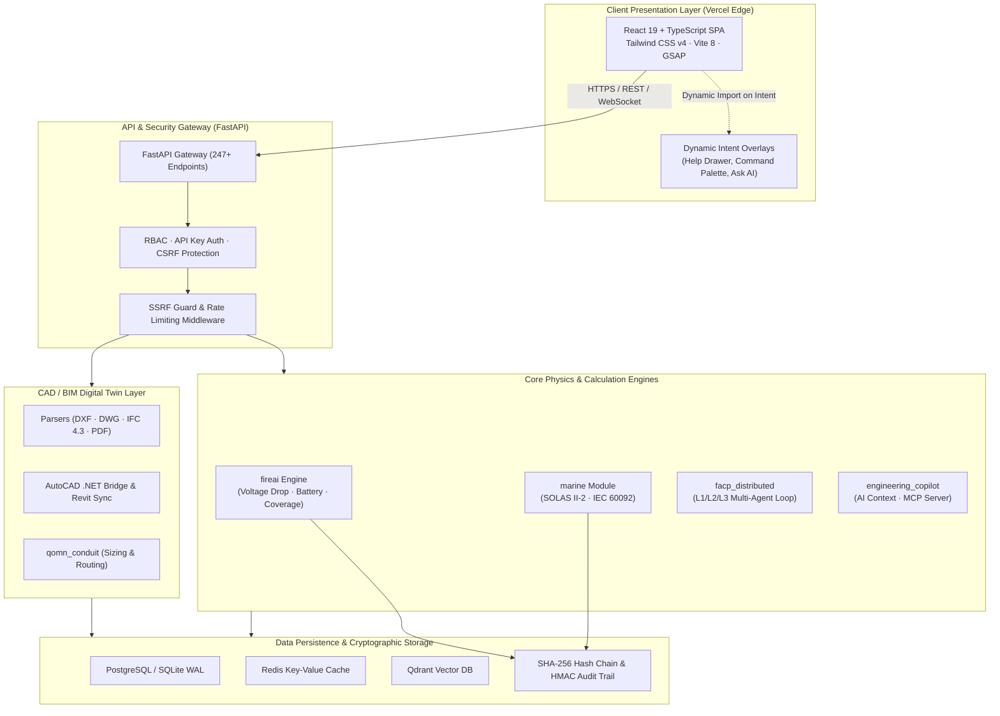

<div align="center">

# 🔥 BAZspark

**Life-Safety Fire Alarm Engineering, BIM Digital Twin & Compliance Verification Platform**

[](https://github.com/ahmdelbaz28-ux/BAZspark/releases)
[](https://github.com/ahmdelbaz28-ux/BAZspark/actions)
[](https://www.python.org/)
[](https://www.typescriptlang.org/)
[](https://react.dev/)
[](https://fastapi.tiangolo.com/)
[](https://github.com/ahmdelbaz28-ux/BAZspark/blob/main/LICENSE)

<br/>

[](https://ba-zspark-tau.vercel.app)
[](https://ahmdelbaz28-bazspark.hf.space)

</div>

---

## 📋 Executive Overview

**BAZspark** is an engineering analysis and compliance-support platform designed to streamline life-safety fire alarm design, engineering calculations aligned with **NFPA 72-2022**, **NEC**, and **SOLAS Marine** requirements, and CAD/BIM digital twin synchronization.

By integrating physics-based voltage drop and battery sizing algorithms with CAD/BIM geometry parsers (AutoCAD DWG, DXF, IFC 4.3, Revit) and a tamper-evident SHA-256 cryptographic audit trail, BAZspark reduces manual drafting discrepancies, accelerates life-safety verification workflows, and provides verifiable calculation records for consulting engineers, authorities having jurisdiction (AHJs), and BIM coordinators.

---

## 🎯 Key Capabilities

### ⚡ Deterministic Fire Protection Calculations
- **Voltage Drop & Circuit Sizing (`fireai/calculations/voltage_drop.py`):** Point-to-point and lump-sum voltage calculations along Notification Appliance Circuits (NAC) and Signaling Line Circuits (SLC) using engineering tables derived from NFPA 72 & NEC Chapter 9.
- **Secondary Power & Battery Capacity (`fireai/calculations/battery.py`):** Standby (24h/60h) and Alarm (5m/15m) ampere-hour sizing with standard safety derating factors.
- **Coverage & Spacing Kernel (`fireai/calculations/coverage.py`):** Geometric coverage algorithms for smoke, heat, flame detectors, and notification appliances considering ceiling heights, beam obstructions, and ventilation airflow.

### 🏢 Digital Twin & CAD/BIM Integration
- **DWG / DXF / PDF Extraction (`parsers/`):** High-throughput geometry extraction for room boundaries, cable pathways, partitions, and device coordinates.
- **IFC 4.3 & Revit Synchronization (`autocad_addin/`, `adapters/`):** Bidirectional transformation of fire protection assets between 2D CAD drafting layers and 3D BIM coordinate models.
- **Conduit & Cable Routing (`qomn_conduit/`):** Automated conduit filling calculations, bend radius verification, and 3D clash detection.

### 🛡️ Tamper-Evident SHA-256 Audit Trail
- **Cryptographic Hash Chaining (`fireai/core/audit_trail.py`):** Every design decision, parameter alteration, and calculation outcome is linked in an append-only SHA-256 hash chain with HMAC-SHA256 signatures for instance-level verifiable integrity.
- **External TSA Integration Bridge:** Modular architecture designed to interface with external RFC 3161 Trusted Timestamp Authorities where legally binding regulatory submissions are required (`fireai/core/audit_blockchain_bridge.py`).

### 🚢 Marine Fire Protection Engineering
- **SOLAS & Marine Safety (`marine/`):** Specialized calculation routines verifying fire detection topologies per SOLAS Chapter II-2, IEC 60092 electrical installations in ships, and ISO 15370 low-location lighting.

### 🤖 Multi-Agent FACP & Engineering Copilot
- **Distributed FACP Pipeline (`facp_distributed/`):** Layered multi-agent architecture (L1 Reflex, L2 Tactical, L3 Strategic) modeling network panel communications and fault survivability (Class A / Class B / Class X).
- **Engineering Copilot & Model Context Protocol (`engineering_copilot/`):** LLM-assisted engineering query engine exposing specialized domain tools via MCP servers for code compliance lookup and design rationale.

---

## 🖼️ User Interface & Visuals

| System Dashboard | Interactive Fire Alarm Designer |
|:---:|:---:|
|  |  |
| *Real-time project telemetry, calculations, and device counts* | *Canvas designer with live circuit loading and coverage overlays* |

| BIM Digital Twin Converter | Regulatory Compliance Center |
|:---:|:---:|
|  |  |
| *Multi-format CAD to Revit IFC 4.3 element transformation* | *Automated NFPA 72 & SOLAS clause-by-clause verification* |

| Engineering Calculations Workspace | Multi-Agent FACP Pipeline |
|:---:|:---:|
|  |  |
| *Voltage drop, battery standby, and sound level calculations* | *Distributed L1/L2/L3 multi-agent survivability simulation* |

| Marine SOLAS Fire Protection | Automated Submittals & Reports |
|:---:|:---:|
|  |  |
| *SOLAS II-2 & IEC 60092 marine detection topology verification* | *Deterministic Bill of Quantities (BOQ) and regulatory submittals* |

---

## 🏗️ Architecture & System Topology



---

## 🧰 Technology Stack

| Layer | Technologies | Primary Purpose |
| :--- | :--- | :--- |
| **Frontend SPA** | React 19.2+, TypeScript 5.9+, Vite 8+, Tailwind CSS v4, GSAP | High-performance life-safety engineering web interface |
| **State & Routing** | TanStack Query v5, Zustand, React Router DOM v7 | Server state caching, optimistic UI updates, client-side routing |
| **Backend API** | Python 3.12+, FastAPI 0.115+, Uvicorn, Pydantic v2 | High-throughput REST & WebSocket endpoints (247+ routes) with strict validation |
| **Physics & Math** | NumPy, SciPy, NetworkX, Shapely | Deterministic voltage drop, graph flow, geometric coverage, and circuit optimization |
| **BIM & CAD** | ezdxf, IfcOpenShell, C# .NET AutoCAD Interop | Bidirectional extraction and conversion of DWG, DXF, and IFC 4.3 building data |
| **Storage & Caching** | PostgreSQL, SQLite (WAL mode), Redis, Qdrant | Relational schemas, local edge WAL caching, vector embeddings for code retrieval |
| **Security & Crypto** | PyCryptodome, HMAC-SHA256, Argon2, DefusedXML | Cryptographic audit hash chains, password hashing, XML/CAD XXE protection |
| **Testing & QA** | Vitest, Pytest, Playwright, Dependency-Cruiser, ESLint | 370+ frontend tests, 890+ backend tests, E2E browser automation, architectural boundary enforcement |
| **CI / CD & Infra** | GitHub Actions (15 workflows), Docker, Helm, Vercel | Automated quality gates, container scans, performance budget enforcement, edge hosting |

---

## 📁 Repository Structure

```
BAZspark/
├── adapters/              # Cross-module data adapters (PDF-to-rooms, CAD transformations)
├── alembic/               # Database migration versions and environment scripts
├── autocad_addin/         # C# .NET AutoCAD and Revit integration bridge
├── backend/               # FastAPI application, route handlers, auth, and services
│   ├── core/              # Global backend configuration, security settings, and logging
│   ├── db/                # SQLAlchemy database models, session management, migrations
│   ├── integrations/      # Third-party integrations and external service connectors
│   ├── middleware/        # Security headers, CSP, SSRF guards, and rate limiters
│   ├── routers/           # 247+ modular API endpoints (Calculations, BIM, Devices, FACP)
│   ├── services/          # Domain business logic layer
│   └── use_cases/         # Application orchestration workflows
├── core/                  # Shared base utilities: retry logic, telemetry, and base models
├── deploy/                # Deployment descriptors: Dockerfile, Docker Compose, Kubernetes, Helm
├── docs/                  # In-depth architectural designs, engineering basis, and guides
├── engineering_copilot/   # AI Copilot engine, prompt templates, and MCP server tools
├── facp_distributed/      # Multi-agent distributed Fire Alarm Control Panel state engine
├── fireai/                # NFPA 72 calculation engine, code constants, and audit trail
├── frontend/              # Modern React + Vite Single Page Application
│   ├── src/
│   │   ├── components/    # Reusable UI widgets, layout shells, and canvas components
│   │   ├── engine/        # Client-side validation, calculations, and export engines
│   │   ├── hooks/         # Custom React hooks (voice control, shortcuts, telemetry)
│   │   ├── packages/      # Deep domain modules with strict boundary enforcement
│   │   ├── pages/         # Top-level route views (Dashboard, Engineering, Digital Twin)
│   │   └── services/      # Typed API client, CSRF handlers, and token storage
│   └── scripts/           # Performance budget CI validators and build helpers
├── marine/                # SOLAS II-2 & IEC 60092 marine fire detection compliance module
├── parsers/               # High-speed CAD (DXF, DWG), IFC 4.3, and vector PDF parsers
├── qomn_conduit/          # Physical conduit fill and 3D cable tray routing engine
├── qomn_fire/             # Independent QOMN-FIRE computational physics kernel
├── scripts/               # Operational utilities, secret scanners, and validation scripts
├── tests/                 # Full backend Pytest suite (unit, integration, property-based)
├── ARCHITECTURE.md        # Comprehensive system architecture document
├── CHANGELOG.md           # Release history and version migration notes
├── CI-CD-POLICY.md        # Mandatory 12-rule CI/CD and feature branching policy
├── CONFIGURATION_GUIDE.md # Detailed environment configuration reference
├── CONTRIBUTING.md        # Engineering guidelines, PR standards, and review processes
├── Dockerfile             # Multi-stage production container image
├── ENGINEERING_BASIS.md   # Mathematical formulas, NFPA citations, and derivations
├── LICENSE                # MIT Open Source License
├── ONBOARDING.md          # Step-by-step developer onboarding manual
├── SECURITY.md            # Defense-in-depth security model and disclosure policy
└── VERSION                # Authoritative semantic version identifier
```

---

## ⚙️ Prerequisites & Installation

### System Requirements
- **Python:** `3.12+` (per `pyproject.toml` specification)
- **Node.js:** `22.x+` | **npm:** `10.8.2+`
- **Git:** `2.40+`
- **Docker & Docker Compose:** *(Optional for containerized execution)*

---

### Option A: Running with Docker Compose (Fastest)

```bash
# 1. Clone the repository
git clone https://github.com/ahmdelbaz28-ux/BAZspark.git
cd BAZspark

# 2. Build and launch the containerized stack
docker-compose up -d --build

# 3. Access the services:
#    - Frontend UI : http://localhost:5173 (or http://localhost:3000)
#    - Backend API : http://localhost:8000/docs
```

---

### Option B: Local Development Setup

#### 1. Backend Setup (FastAPI)

```bash
# Navigate to repository root
cd BAZspark

# Create and activate a Python virtual environment
python -m venv .venv
# On Windows:
.venv\Scripts\activate
# On Linux/macOS:
source .venv/bin/activate

# Install backend dependencies with development and parsing extras
pip install -e ".[dev,parsing]"

# Configure required environment variables
export FIREAI_API_KEY="dev-secret-api-key"
export FIREAI_SESSION_SECRET=$(python -m backend.session_secret generate | tail -1)

# Run database migrations
alembic upgrade head

# Start FastAPI development server
uvicorn backend.app:app --reload --host 127.0.0.1 --port 8000
```

#### 2. Frontend Setup (React + Vite)

```bash
# In a second terminal window:
cd BAZspark/frontend

# Install dependencies using exact package-lock
npm ci

# Launch Vite development server
npm run dev

# Open your browser at http://localhost:5173
```

---

## 🔐 Configuration & Environment Variables

Create a `.env` file in the root directory (refer to [.env.example](.env.example)):

| Variable | Type | Default | Description |
| :--- | :---: | :---: | :--- |
| `FIREAI_API_KEY` | **Required** | — | Master API key for backend route authorization |
| `FIREAI_SESSION_SECRET` | **Required** | — | 32-byte cryptographic secret for session token signing |
| `DATABASE_URL` | Optional | `sqlite:///./fireai.db` | PostgreSQL connection URI or SQLite WAL path |
| `REDIS_URL` | Optional | `redis://localhost:6379/0` | Redis caching & async task broker connection string |
| `QDRANT_URL` | Optional | `http://localhost:6333` | Vector database endpoint for semantic code & design retrieval |
| `CORS_ORIGINS` | Optional | `http://localhost:5173,...` | Comma-separated allowed CORS origin URLs |
| `VITE_API_BASE_URL` | Optional | `http://localhost:8000` | (Frontend) Target backend base URL |

*(For full configuration options, see [CONFIGURATION_GUIDE.md](CONFIGURATION_GUIDE.md) and [docs/API_KEYS_GUIDE.md](docs/API_KEYS_GUIDE.md)).*

---

## 🧪 Testing & Quality Assurance

BAZspark enforces automated testing and architectural boundary verification across all modules.

### Frontend Quality Gates
```bash
cd frontend

# 1. Static Type Checking (TypeScript 0 errors)
npm run typecheck

# 2. ESLint Static Analysis (0 errors, 0 warnings)
npm run lint

# 3. Architectural Modular Boundary Enforcement (depcruise)
npm run lint:boundaries

# 4. CI Performance Budget Validation (< 220KB JS entry, 0 overlay leaks)
npm run perf:check

# 5. Vitest Unit & Component Suite (370+ tests)
npm run test
```

### Backend Quality Gates
```bash
# In repository root with virtualenv active:

# 1. Full Pytest Suite (890+ unit, integration, and property tests)
pytest backend/tests/

# 2. Safety Calculation & Determinism Verification
pytest tests/ -k "calculation or voltage or battery"
```

---

## 🚀 Production Deployment & CI/CD

### Verified Production Environments
- **Frontend SPA (Vercel Edge):** [https://ba-zspark-tau.vercel.app/](https://ba-zspark-tau.vercel.app/)
  - Deployed on Vercel Global Edge Network with immutable asset caching (`max-age=31536000`).
  - Active Content Security Policy (CSP), HSTS, and strict origin isolation.
- **Backend API (Hugging Face Space):** [https://ahmdelbaz28-bazspark.hf.space](https://ahmdelbaz28-bazspark.hf.space)
  - Hosted FastAPI application serving calculations, OpenAPI documentation (`/docs`), and database services.

### CI/CD Enforcement (12 Mandatory Rules)
All pull requests and code modifications must adhere to [CI-CD-POLICY.md](CI-CD-POLICY.md):
- **Rule 1 (Root Cause First):** Symptom workarounds are strictly rejected.
- **Rule 4 (Safe Push):** Local linting, typecheck, boundaries, and test suites must pass before push.
- **Rule 8 (Git Safety):** Force pushes and history rewrites on shared branches are strictly forbidden.

---

## 🔒 Security Architecture

BAZspark incorporates a defense-in-depth security model:
1. **Content Security Policy (CSP):** Emits strict CSP restricting script execution to origin and Vercel Analytics, with frame-ancestors set to `'none'` to prevent clickjacking.
2. **SSRF & Input Defense:** Backend includes strict Server-Side Request Forgery (SSRF) guards and XML/CAD entity expansion (XXE) protection via `defusedxml`.
3. **Cryptographic Tamper-Evidence:** Calculations generate append-only SHA-256 hash chains with HMAC validation, preserving a cryptographically verifiable chain of custody.
4. **Secret Scanning:** Automated CI workflows scan all commits and PR diffs for accidental credential leakage.

*(For vulnerability disclosure and policy, refer to [SECURITY.md](SECURITY.md)).*

---

## ⚡ Performance Profile

*Empirically measured under real-world production network conditions (Commit `31cad184`):*
- **Main JS Entry Weight:** `200.30 KB` raw (`61.23 KB` gzip).
- **Desktop FCP (Warm Cache):** `124.2 ms` (Instant shell paint from immutable cache).
- **Desktop FCP (Cold Cache):** `623.4 ms` (Over public Edge network).
- **Cumulative Layout Shift (CLS):** `0.0000` (Zero layout shifting).
- **Total Blocking Time (TBT):** `0.00 ms` (Zero blocking main-thread tasks > 50ms).
- **100% Overlay Dynamic Isolation:** Heavy drawer and modal assets (`GlobalHelpDrawer`, `CommandPalette`, `AskAiSheet`, `helpTopics`) are strictly excluded from initial HTML preloads and loaded on demand.

---

## ⚠️ Known Operational Limitations

1. **Backend Cold-Start Latency:** The free-tier Hugging Face Space backend may experience a ~2.6s cold start upon waking from prolonged idle periods (subsequent requests execute in ~140ms). The frontend SPA is decoupled and renders instantly without blocking on backend wake.
2. **RFC 3161 TSA Timestamping:** The internal SHA-256 audit trail provides instance-level tamper evidence; legally binding regulatory filings require configuring an external RFC 3161 Timestamp Authority in `fireai/core/audit_blockchain_bridge.py`.
3. **AutoCAD .NET Bridge:** Direct interop with Autodesk AutoCAD requires a Windows environment with AutoCAD runtime libraries installed (`autocad_addin/`).

---

## 📖 Documentation Index

| Documentation File | Subject & Scope |
| :--- | :--- |
| [ARCHITECTURE.md](ARCHITECTURE.md) | In-depth system architecture, module boundaries, and data flow |
| [ENGINEERING_BASIS.md](ENGINEERING_BASIS.md) | Mathematical formulas, NFPA 72 derivations, and electrical citations |
| [CONFIGURATION_GUIDE.md](CONFIGURATION_GUIDE.md) | Complete environment variable specifications and secrets guide |
| [SECURITY.md](SECURITY.md) | Defense-in-depth architecture and vulnerability reporting |
| [CONTRIBUTING.md](CONTRIBUTING.md) | Code contribution guidelines, branching rules, and PR checklist |
| [ONBOARDING.md](ONBOARDING.md) | Step-by-step onboarding walkthrough for new developers |
| [CI-CD-POLICY.md](CI-CD-POLICY.md) | 12 mandatory rules governing testing, branching, and deployments |
| [TROUBLESHOOTING_GUIDE.md](TROUBLESHOOTING_GUIDE.md) | Diagnostics, common errors, and resolution recipes |
| [docs/FACP_SPECIFICATION.md](docs/FACP_SPECIFICATION.md) | FACP calculation protocols, loop classes, and standards |
| [docs/PRODUCTION_DEPLOYMENT_GUIDE.md](docs/PRODUCTION_DEPLOYMENT_GUIDE.md) | Detailed Docker Compose, Kubernetes, and Vercel setup |

---

## 👥 Contributing

We welcome engineering contributions from fire protection engineers, BIM coordinators, and software developers. 

Please review [CONTRIBUTING.md](CONTRIBUTING.md) and [ONBOARDING.md](ONBOARDING.md) before submitting code. Any modifications to calculation algorithms (`fireai/calculations/`) or NFPA constants require 100% branch coverage and property-based regression tests.

<div align="center">

<a href="https://github.com/ahmdelbaz28-ux/BAZspark/graphs/contributors">
  
</a>

</div>

---

## 📜 License & Authors

Distributed under the **MIT License**. See [LICENSE](LICENSE) for full terms.

**Lead Architect & Engineer:** **Eng. Ahmed Elbaz** ([@ahmdelbaz28-ux](https://github.com/ahmdelbaz28-ux))

---

<div align="center">

[](https://star-history.com/#ahmdelbaz28-ux/BAZspark&Date)

</div>
