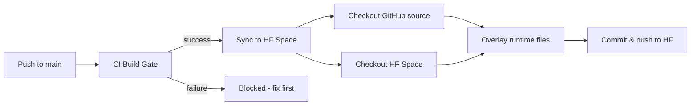

# BAZspark Sync & Architecture Policy

## Single Source of Truth

**GitHub (`BAZspark-full`) is the SINGLE SOURCE OF TRUTH** for all code.

**HuggingFace Spaces (`BAZSPARK-hf`) is a DEPLOYMENT TARGET only.**

No developer ever edits code on HuggingFace directly. All code changes happen on GitHub, then are automatically synced to HuggingFace via the CI/CD pipeline.

---

## Repository Architecture

```
GitHub (ahmdelbaz28-ux/BAZspark)
│
│   FULL MONOREPO containing:
│   ├── backend/           - FastAPI application
│   ├── frontend/          - React + Vite SPA
│   ├── fireai/            - Fire protection engineering engine
│   ├── marine/            - Marine fire safety system
│   ├── parsers/           - File parsers (DWG, DXF, PDF, IFC)
│   ├── adapters/          - External system adapters
│   ├── core/              - Shared core modules
│   ├── integration/       - Third-party integrations
│   ├── facp_system/       - Fire Alarm Control Panel system
│   ├── qomn_conduit/      - Conduit fill analysis
│   ├── qomn_fire/         - QOMN fire calculations
│   ├── Dockerfile         - Container build (exec form CMD)
│   ├── pyproject.toml     - Python dependencies
│   ├── requirements.txt   - Pinned dependencies
│   └── .dockerignore      - Docker build exclusions
│
│   CI/CD (sync-to-hf.yml)
│       ↓
│   RUNTIME SUBSET (whitelisted paths only)
│
HuggingFace (ahmdelbaz28/BAZSPARK)
    │
    DEPLOYMENT TARGET containing only runtime files:
    ├── backend/           - Same as GitHub, auto-synced
    ├── frontend/          - Same as GitHub, auto-synced
    ├── fireai/            - Same as GitHub, auto-synced
    └── ...                - Same runtime paths as GitHub
```

---

## Sync Mechanism

### Trigger
- **Automatic**: After every successful CI Build Gate on `main` branch
- **Manual**: Via `workflow_dispatch` in GitHub Actions

### Workflow: `.github/workflows/sync-to-hf.yml`



### What Gets Synced

```
RUNTIME_PATHS:
  Dockerfile
  pyproject.toml
  requirements.txt
  .dockerignore
  adapters/
  backend/
  core/
  facp_system/
  fireai/
  frontend/
  integration/
  marine/
  parsers/
  qomn_conduit/
  qomn_fire/
```

### What Is Excluded

```
.github/           - CI/CD config (not needed at runtime)
tests/             - Test files (not needed at runtime)
docs/              - Documentation (not needed at runtime)
skills/            - Agent skills (not needed at runtime)
deploy/            - Deployment configs (not needed at runtime)
services/          - External services (not needed at runtime)
templates/         - Templates (not needed at runtime)
alemmbic/          - Alembic migrations (not needed at runtime)
revit_data/        - Large test assets (not needed at runtime)
SYNC_POLICY.md     - This document (not needed at runtime)
```

---

## Branch & Release Strategy

```
main                     ← Production branch. Auto-syncs to HF on CI success.
  │
  ├── feature/*          ← Feature branches. Merge to main via PR.
  ├── fix/*              ← Bug fix branches. Merge to main via PR.
  └── chore/*            ← Maintenance branches. Merge to main via PR.
```

### Branch Rules
- `main` is protected: requires passing CI + review
- Feature branches: `feature/<description>` (e.g., `feature/unified-sync-policy`)
- Fix branches: `fix/<description>` (e.g., `fix/etap-cors-error`)
- No direct pushes to `main` without review

---

## Code Quality Gates

### Required Before Merge
| Gate | Tool | Target |
|------|------|--------|
| Linting | Ruff | Zero errors on diff |
| Type Checking | mypy | No new errors |
| Tests | pytest | All pass, coverage ≥ 47% |
| CI Build | GitHub Actions | Green |
| SonarCloud | CI pipeline | Quality Gate passing |

### SonarCloud
- Project key: `ahmdelbaz28-ux_revit`
- Quality Gate: **Must pass** before merging to `main`
- Current status: [SonarCloud Dashboard](https://sonarcloud.io/project/overview?id=ahmdelbaz28-ux_revit)

---

## HF Space Configuration

| Setting | Value |
|---------|-------|
| HF Username | `ahmdelbaz28` |
| HF Space | `BAZSPARK` |
| HF Token | `HF_TOKEN` (GitHub secret) |
| Dockerfile CMD | `CMD ["sh", "-c", "uvicorn backend.app:app ..."]` (exec form) |
| PYTHON_VERSION | 3.11+ |
| Frontend | Vite + React, built during Docker build |

### HF Environment Variables
Configured in HuggingFace Space settings:
- `FIREAI_ENV` = `production`
- `FIREAI_SESSION_SECRET` = (set via secret)
- `CORS_ORIGINS` = (Space URL)
- `BAZSPARK_FRONTEND_DIST` = `/app/frontend_dist`

---

## Recovery Procedures

### If sync-to-hf fails
1. Check GitHub Actions → `Sync to HuggingFace Space` workflow
2. Verify `HF_TOKEN` is valid (not expired)
3. Re-run failed job, or trigger via `workflow_dispatch`
4. If HF is out of sync, manually sync from local:
   ```
   git clone https://github.com/ahmdelbaz28-ux/BAZspark.git /tmp/sync
   git clone https://huggingface.co/spaces/ahmdelbaz28/BAZSPARK /tmp/hf
   # Overlay runtime files
   cp -r /tmp/sync/backend /tmp/hf/backend
   # ... (all runtime paths)
   cd /tmp/hf && git add -A && git commit -m "Manual sync" && git push
   ```

### If HF Space fails to build
1. Check HF Space logs
2. Verify `pyproject.toml` dependencies are resolvable
3. Check Dockerfile syntax (must use exec form)
4. Ensure `HF_README.md` exists in GitHub repo (synced as `README.md`)

---

## History

| Date | Change |
|------|--------|
| 2026-07-26 | Fixed sync-to-hf.yml: removed `environment: huggingface-production` gate |
| 2026-07-26 | Direct sync: 347 files synced, 180 commits closed |
| 2026-07-26 | Removed deprecated `sync_v2.ps1` |
| 2026-07-26 | Deduplicated `.gitignore` (494 → 310 lines) |
| 2026-07-26 | Resolved case collision: removed `PULL_REQUEST_TEMPLATE.md` |
| 2026-07-26 | Ruff auto-fixes: cleaned noqa, import, type annotation issues |
