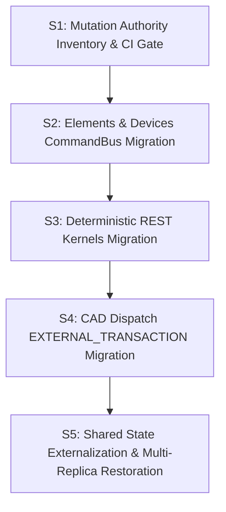

# Mutation Authority & State Externalization Architecture (Phase 4)

## 1. Executive Summary & Chain of Authority

This document defines the Mutation Authority architecture, the complete mutation inventory, the state externalization strategy, and the formal lifting of Containment A6 for Phase 4 of BAZSpark, in accordance with `BAZSPARK_PLAN_V2_2.md §5 Phase 4`.

- **Base Commit:** `38dd0977897756c4f984264297c8c6b038b9500e` (FG-3 Verified)
- **Feature Branch:** `feature/phase-4-mutation-authority`

---

## 2. The 4 Authority Classes

Every write, mutation, or state-changing entry point in the system is strictly classified into one of four authority classes:

| Authority Class | Description | Guarantees & Protocols |
|---|---|---|
| **`CANONICAL_COMMAND`** | Domain mutations that alter the canonical BIM/CAD project state. | Routes through `CommandBus.execute()` with Optimistic Concurrency Control (`expected_revision`), idempotency deduplication (`idempotency_key`), and immutable SHA-256 HMAC audit chaining (`AuditStore`). |
| **`EXTERNAL_TRANSACTION`** | External CAD live environment dispatches (Revit/AutoCAD desktop agents). | Governed by **Principle 3**: CommandBus coordinates and logs the dispatch; external adapter executes within its native CAD process; verification is evidence-based (geometry hash, element IDs); compensation callbacks are declared upon partial failure. |
| **`SYSTEM_INFRASTRUCTURE`** | Platform infrastructure, database migrations (Alembic), system health, billing ledgers, auth keys, observability, and background workers. | Operations outside the canonical CAD state model (e.g. schema DDL, user preferences, API key revocation, Stripe/Meeza IPN records, vector embeddings, memory graph) interacting directly with system infrastructure repositories. |
| **`LEGACY_EXCEPTION`** | Temporary mutation bypass awaiting migration in Phase 4 sub-phases. | Tracked in `bypass_exceptions.yaml` with explicit `owner`, `deadline`, and `removal_condition`. Shrinks as S2, S3, and S4 are executed. |

---

## 3. Inventory Methodology & AST Crawler Coverage

The mutation inventory (`backend/tests/architecture/mutation_authority_inventory.yaml`) was constructed using an AST crawler covering 100% of all router files (`backend/routers/**`), WebSocket message handlers (`backend/routers/agent_ws.py`), background tasks, Alembic database migrations, and webhook ingress points.

- **Total Cataloged Mutation Points:** 220
- **CI Gate Enforcement:** `backend/tests/architecture/test_mutation_authority_gate.py` runs automatically on every CI run to prevent any uncataloged mutation routes from being introduced.

---

## 4. State Externalization Strategy (S5)

### Problem Definition (E12 & A6)
Previously, in-memory singletons (`active_agents`, `_ws_tickets`, `idempotency_cache`, LangGraph checkpointer) bound the application to a single process (`replicas = 1` containment under A6).

### Shared Store Selection: PostgreSQL Repository + Redis Option
- **Primary Shared Store:** PostgreSQL DB Repository (`project_revisions`, `ws_tickets`, `idempotent_commands`, `agent_sessions`).
- **Rationale:** Leverages existing high-availability ACID database infrastructure without introducing mandatory external dependencies, while fully supporting multi-replica concurrency via row-level locking and atomic transactions.
- **Lifting Containment A6:** With state externalized to PostgreSQL/Redis, `replicas >= 2` is officially restored in `docker-compose.yml` and `render.yaml`.

---

## 5. Migration Roadmap (S1 $\rightarrow$ S5)

