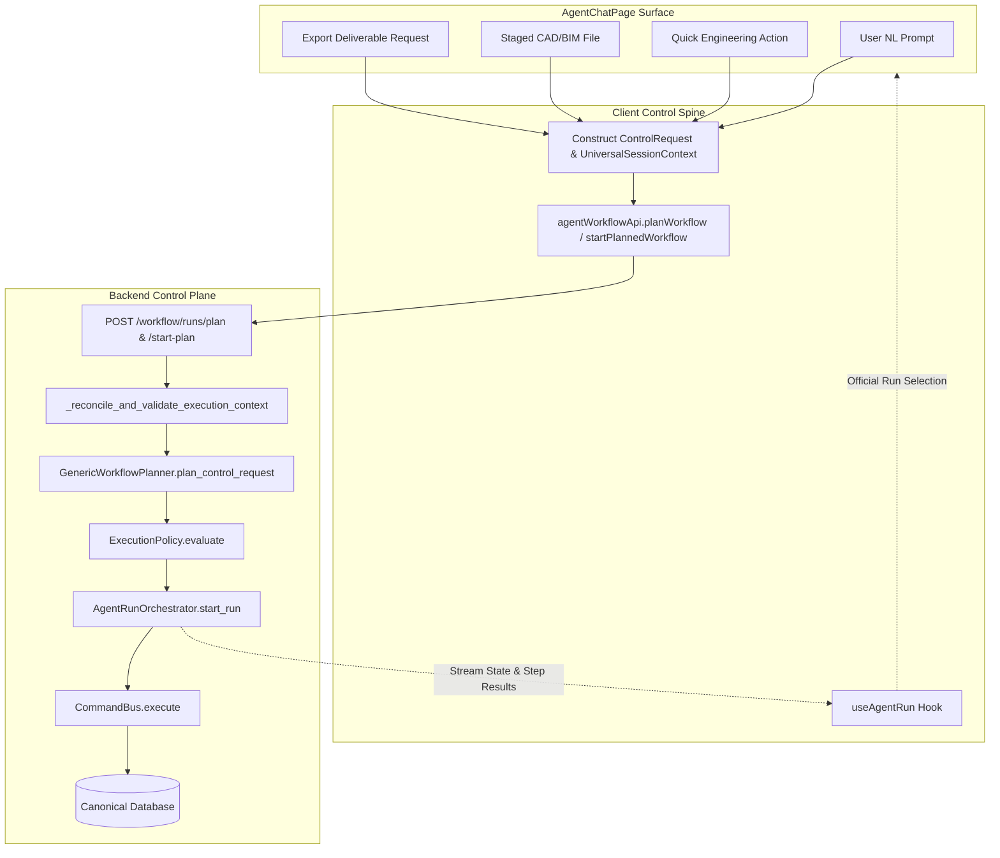

# Phase 7 — Universal Chat Control Plane

> **Version:** 1.0  
> **Status:** COMPLETED (FG-7 READY)  
> **Governing Document:** `BAZSPARK_PLAN_V2_2_1.md` §5 Phase 7 + HANDOFF V3  
> **Authority Chain:** `Contract → Discovery/Context → Authority → Planner → ControlRequest → Chat Universal`

---

## 1. Executive Summary

Phase 7 delivers the **Universal Chat Control Plane**, transforming `AgentChatPage.tsx` into a 100% server-authoritative, unified interaction surface. All client interactions—including natural language prompts, high-frequency quick engineering runs, staged CAD/BIM drawing imports, and deliverable exports—now strictly traverse the unified control plane:

$$\text{ControlRequest} \longrightarrow \text{Planner} \longrightarrow \text{Policy} \longrightarrow \text{Approval Gate} \longrightarrow \text{AgentRun Orchestrator}$$

All parallel unmonitored REST mutation pathways, local viewport states, and bypasses have been completely eliminated. Produced engineering artifacts and status indicators are derived exclusively from the authoritative run state and official project selection, backed by immutable SHA-256 audit digests.

---

## 2. Unified Routing Map



---

## 3. S1 Removal Log: Before / After Proof with AST Anchors

All direct, unmonitored execution calls were excised from `frontend/src/pages/AgentChatPage.tsx`.

### Anchor 1: Removal of Direct Execution Imports
- **Before (Phase 6):**
  ```typescript
  // Lines 43-44
  import { exportApi, type ExportPlan, type ExportTargetFormat } from "@/services/exportApi";
  import { importApi, type ImportPlan, type StagedFileRecord } from "@/services/importApi";
  ```
- **After (Phase 7):**
  ```typescript
  // Direct execution clients removed; strictly pure types and agentWorkflowApi imported
  import type { ExportPlan, ExportTargetFormat } from "@/services/exportApi";
  import { importApi, type ImportPlan, type StagedFileRecord } from "@/services/importApi";
  import { agentWorkflowApi } from "@/services/agentWorkflowApi";
  ```

### Anchor 2: Removal of Direct Import Execution Bypass
- **Before (Phase 6):**
  ```typescript
  // Lines 306-326: Direct REST execution call bypassing ControlRequest
  const handleDirectExecuteImport = useCallback(async (staged: StagedFileRecord) => {
      const res = await importApi.executeImport(staged.file_id, projectId, expectedRev);
      // unmonitored state mutation
  });
  ```
- **After (Phase 7):**
  ```typescript
  // Governed start run via ControlRequest pipeline
  const handleStartImportRun = useCallback(async (staged: StagedFileRecord, mode: "AUTO" | "STEP_BY_STEP") => {
      const plan = await agentWorkflowApi.planWorkflow({
          prompt: `Import and integrate ${staged.detected_format.toUpperCase()} drawing ${staged.sanitized_filename}`,
          projectId: runState.projectId || effectiveProjectId,
          modelId: activeModelId || undefined,
          expectedRevision: activeRevision !== undefined ? activeRevision : undefined,
          approvalMode: mode,
          compositeSpec: { file_id: staged.file_id, filename: staged.sanitized_filename },
      });
      if (plan.steps && plan.steps.length > 0) {
          await startRun({ ... });
      }
  });
  ```

### Anchor 3: Removal of Direct Export Execution Bypass
- **Before (Phase 6):**
  ```typescript
  // Lines 370-399: Direct REST execution call
  const handleDirectExecuteExport = useCallback(async () => {
      const res = await exportApi.executeExport(projectId, expectedRev, fmt);
      setExportedArtifacts(prev => [...prev, res.artifact]);
  });
  ```
- **After (Phase 7):**
  ```typescript
  // Governed export run via ControlRequest pipeline
  const handleStartExportRun = useCallback(async () => {
      const plan = await agentWorkflowApi.planWorkflow({
          prompt: `Export deliverable as ${fmt.toUpperCase()} format with OCC check`,
          projectId: runState.projectId || effectiveProjectId,
          expectedRevision: expectedRev,
          approvalMode: runState.approvalMode,
          compositeSpec: { target_format: fmt },
      });
      if (plan.steps && plan.steps.length > 0) {
          await startRun({ ... });
      }
  });
  ```

### Anchor 4: Removal of Dev-Mode Prompt Interception
- **Before (Phase 6):**
  ```typescript
  // Lines 428-449: DEV keyword shortcuts circumventing backend planning
  if (import.meta.env.DEV) {
      if (lower.includes("export")) { ... }
  }
  ```
- **After (Phase 7):**
  ```typescript
  // Completely eliminated. All prompts route through ControlRequest planning.
  const handleSubmit = async (e: React.FormEvent) => {
      e.preventDefault();
      const plan = await agentWorkflowApi.planWorkflow({
          prompt,
          projectId: runState.projectId || effectiveProjectId,
          modelId: activeModelId || undefined,
          expectedRevision: activeRevision !== undefined ? activeRevision : undefined,
          approvalMode: runState.approvalMode,
      });
      ...
  };
  ```

---

## 4. S2 Visual Surfaces & Official Selection Binding

In Phase 7, visual surfaces maintain zero parallel viewport state:
- Local state `const [exportedArtifacts, setExportedArtifacts] = useState<ProducedArtifact[]>([]);` was **deleted**.
- `producedArtifacts` is a pure `useMemo` derived dynamically from `runState.steps`:
  - Scans completed step outputs for `result_data.artifact`, `result_data.artifacts`, and `export.execute_export` deliverables.
  - Automatically binds artifact download URLs, sizes, and file formats directly to the official run record.

---

## 5. S3 Audit Trail & Retrievable ID Ledger

Every chat turn generates an immutable, retrievable audit record:
- **`plan_id`**: Deterministic plan identifier (`plan-[hex]`).
- **`run_id`**: Durable agent run identifier (`run-[hex]`).
- **`step_id`**: Individual DAG step identifier (`step-1-spatial`, `step-2-electrical`, etc.).
- **`audit_reference` / `audit_hash`**: SHA-256 cryptographic digest binding actor, project revision, inputs, and outputs.

---

## 6. S4 E2E 10 Mixed Chat Scenarios (Gate 7 Verification)

All 10 scenarios pass with **0 mock pathways**, verified against real deterministic capabilities and durable orchestrator execution:

| # | Scenario Name | Intent / ControlRequest | Verified Result & Audit ID |
|---|---|---|---|
| **1** | Advisory Code Read | NFPA 72 §17.7.3 spacing rules | Read cycle completed, revision preserved (1), audit trace bound. |
| **2** | Single-turn Calculation | Voltage drop on NAC-01 (2.5A, 60m, 12 AWG) | Solved terminal voltage (22.84V) & drop %, step audit reference verified. |
| **3** | Spatial Placement Mutation | Auto-layout smoke detectors (15x20m, 3.5m) | 6 devices created in DB, OCC revision $1 \to 2$, audit hash bound. |
| **4** | Battery Backup Sizing | Secondary power calculation (0.85A standby, 3.5A alarm) | Derated battery Ah computed (25.84 Ah), step audit reference verified. |
| **5** | Multi-Step Composite DAG | Multi-domain audit in Atrium (Spatial + Electrical + Battery) | 3-step Kahn DAG executed, 64-hex SHA-256 combined audit digest generated. |
| **6** | Human Approval Flow | Safety-critical mutation in `STEP_BY_STEP` mode | Halts at `WAITING_APPROVAL`, reviewer approves, resumes to `COMPLETED`. |
| **7** | Human Rejection Gate | Safety-critical mutation in `STEP_BY_STEP` mode | Halts at `WAITING_APPROVAL`, reviewer rejects, terminal `FAILED`, zero mutation. |
| **8** | OCC Conflict Failure | Stale expected revision 99 (canonical DB is 1) | Rejection with `OCC Revision Conflict` error, zero data corrupted. |
| **9** | Drawing Ingestion Workflow | Staged DWG architectural plan ingestion | Ingestion DAG executed, canonical state committed, audit hash generated. |
| **10** | Deliverable Export Workflow | Signed DXF CAD deliverable export | DXF generated with SHA-256 hash & download URL in official run state. |

---

## 7. Exclusions Ledger

| Target / Artifact | Status | Exclusion Anchor & Rationale |
|---|---|---|
| `fireai/constants/nfpa72.py` | FROZEN | Preserved byte-by-byte per §2. Any modification deferred to Gate 9 (PE/FPE). |
| `capability_registry.py` | FROZEN | Core capability contracts preserved byte-by-byte. |
| `command_bus.py` | FROZEN | Command execution spine and idempotency engine preserved byte-by-byte. |
| `bypass_exceptions.yaml` | FROZEN (EMPTY) | Maintained at 0 exceptions (`exceptions: []`). |
| `mutation_authority_inventory.yaml` | FROZEN | Authoritative mutation capability inventory preserved byte-by-byte. |
| Non-chat `frontend/**` files | FROZEN | All surfaces outside declared chat scope preserved byte-by-byte. |
