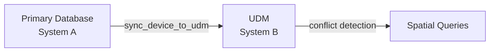

# System Architecture Overview

> **Purpose:** This document explains *why* the BAZSpark system is architected the way it is — the design decisions, trade-offs, and principles that shape the codebase.
>
> For a *descriptive* reference of the architecture (directory structure, layers, components), see [Architecture Reference](../reference/architecture.md).
> For a *hands-on* guide to setting up the system, see [Installation](../how-to/installation.md).
> For a *step-by-step* tutorial, see [First Fire Alarm Design](../tutorials/first-fire-alarm-design.md).

---

## Why Two Engines? (QOMN-FIRE + fireai)

The fire alarm engineering logic lives in two directory trees:

| Directory | Role | Why separate? |
|-----------|------|---------------|
| `fireai/` | Core Python library imported by the FastAPI backend | Provides the canonical NFPA 72 constants, SSoT rules, and shared calculation logic |
| `qomn_fire/` | Standalone deterministic engine | Can run independently of the web backend — useful for CLI usage, batch processing, and integration testing |

**Design principle:** The `fireai/` library is the *single source of truth* for NFPA 72 constants (`fireai/constants/nfpa72.py`). All engines — including `qomn_fire/` — import from this canonical source.

---

## Why FastAPI + React (Not Monolithic)?

The system uses a **separate backend and frontend** rather than a monolithic framework:

- **Separation of concerns**: Engineering calculations are compute-intensive and benefit from dedicated server resources
- **Independent scaling**: The backend can be scaled horizontally for calculation-heavy workloads while the frontend serves static assets from a CDN
- **API-first design**: All functionality is accessible via REST API, enabling third-party integrations, CLI tools, and automation
- **Desktop wrapper**: The Electron wrapper provides AutoCAD/Revit plugin capability without coupling the web UI to desktop-specific code

---

## Why UDM (Universal Data Model)?

The UDM is a secondary, synchronized database used for conflict detection and spatial analysis:

**Design rationale:**

- **Separation of write and read workloads**: Primary DB handles CRUD; UDM handles spatial queries
- **Isolation of conflict detection**: Spatial conflicts (overlapping devices, coverage gaps) don't block primary operations
- **Pluggable backends**: UDM uses SQLite by default but could be swapped for PostGIS without affecting the primary data model

---

## Security Model

The system uses a **defense-in-depth** approach:

1. **API Key Authentication** — Bearer tokens validated via bcrypt
2. **Session Cookies** — HttpOnly, SameSite=Strict, `__Host-` prefixed, HMAC-SHA256 signed
3. **RBAC** — Role-based permissions (`admin`, `engineer`, `reviewer`, `viewer`, `api`)
4. **Audit Trail** — Immutable, HMAC-signed Merkle tree for NFPA 72 compliance

**Why not OAuth2?** Fire protection engineering is a specialized domain with a small, known user base. API keys + session cookies provide sufficient security without the complexity of OAuth2 flows. This can be added in the future if multi-tenant SaaS deployment is needed.

---

## Future Considerations

- **Multi-tenant SaaS** — Would require adding tenant isolation, OAuth2, and per-tenant rate limiting
- **Real-time collaboration** — Would require WebSocket-based conflict resolution and CRDTs for concurrent device placement
- **Offline mode** — Service workers and IndexedDB for the frontend; local SQLite for the backend

---

*This document is part of the Explanation quadrant of the Diátaxis framework. It answers "why" questions about the system design. For descriptive reference material, see [Architecture Reference](../reference/architecture.md).*
